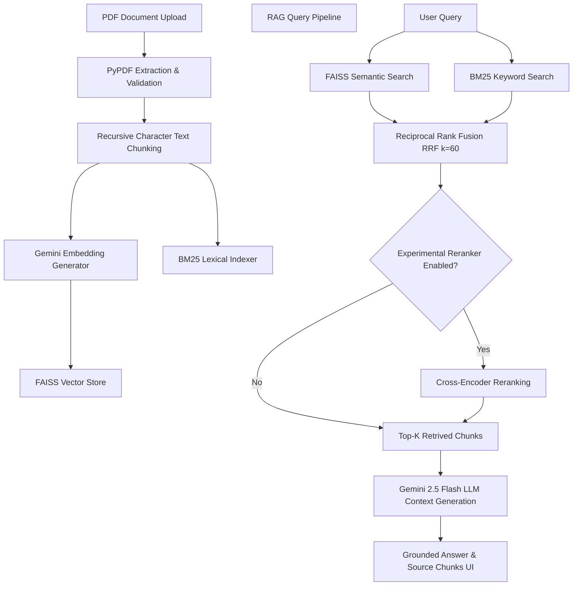

# 🧠 ScholarAI — AI Research Paper Assistant & RAG Benchmark Platform

ScholarAI is an intelligent, production-grade research paper analysis platform and Retrieval-Augmented Generation (RAG) system built with Python, Streamlit, and Google Gemini. It bridges the gap between dense technical literature and rapid comprehension by providing automated executive paper analysis, interactive grounding-backed chat, and an empirical retrieval evaluation dashboard.

---

## 📌 Project Overview

### Problem Statement
Academic literature—especially papers in machine learning, artificial intelligence, and scientific disciplines—contains dense text, complex mathematical notation, specialized terminology, and fine-grained citations. General-purpose LLMs without retrieval context often hallucinate specific values, confuse author attributions, or fail to locate precise formula definitions.

### ScholarAI Solution
ScholarAI addresses these challenges through a dual-mode application:
1. **Automated Analysis & Learning Suite:** Instantly extracts executive summaries, key takeaways, ELI15 (Explain Like I'm 15) breakdowns, difficulty ratings (1–10), self-assessment quizzes, and technical interview questions from uploaded research paper PDFs.
2. **Hybrid RAG Chat System:** Fuses dense vector search (FAISS) and sparse lexical search (BM25) via Reciprocal Rank Fusion (RRF) to retrieve ground-truth source passages, providing verifiable context for Gemini-driven Q&A with transparent chunk attribution.
3. **Empirical Evaluation Pipeline:** Evaluates retrieval strategies offline against a ground-truth benchmark dataset to measure precision, recall, MRR, and end-to-end latency.

---

## ✨ Features

- **PDF Paper Ingestion & Analysis:**
  - Robust text extraction using `PyPDF` with error handling for malformed or image-only PDFs.
  - Generates executive summaries, core contributions, difficulty scores, and beginner-friendly explanations.
  - Produces self-assessment quizzes, technical interview questions, and future research directions.
  - Allows exporting full structured paper analysis to plain text (`.txt`).

- **Multi-Stage RAG Chat Engine:**
  - Interactive Q&A grounded on retrieved research paper text chunks.
  - Transparent UI displaying source chunk text snippets and document section origins.
  - Built-in suggested prompt buttons for common paper questions.

- **Advanced Multi-Retriever Architecture:**
  - **Dense Vector Search (FAISS):** Captures high-level semantic intent using high-dimensional embeddings (`models/gemini-embedding-001`).
  - **Sparse Lexical Search (BM25):** Ensures exact keyword matching for equations (e.g. `Attention(Q, K, V)`), hyperparameter values, and acronyms.
  - **Reciprocal Rank Fusion (RRF):** Fuses dense and sparse candidate lists ($k=60$) to combine semantic recall with lexical precision.
  - **Cross-Encoder Reranking (Experimental):** Modular reranking stage using `ms-marco-MiniLM-L-6-v2` for evaluation benchmarking.

- **Production Robustness (M9):**
  - Validation for query lengths, empty text inputs, and PDF byte limits.
  - Exponential backoff retry logic (1s, 2s, 4s) for API rate limits/errors.
  - Automatic retriever fallbacks (Cross-Encoder → Hybrid RRF → BM25 / FAISS).

- **Live Retrieval Evaluation Dashboard (M7):**
  - Dedicated Streamlit tab displaying live metrics (Precision@5, Recall@5, MRR, and Latency) across retrieval pipelines and embedding models.

---

## 🏗️ Architecture

ScholarAI processes research papers through an end-to-end pipeline:



### Pipeline Flow
1. **Extraction & Chunking:** PDFs are parsed into text, validated against size/content thresholds, and chunked with overlapping windows.
2. **Dual Indexing:** Text chunks are indexed concurrently into a FAISS dense vector store (`models/gemini-embedding-001`, dim 3072) and a BM25 sparse index.
3. **Hybrid Retrieval (RRF):** User queries run in parallel across FAISS and BM25. Results are merged via Reciprocal Rank Fusion ($k=60$).
4. **Context Injection & Generation:** Highest-ranked chunks are formatted into the prompt context for Gemini 2.5 Flash, generating accurate, grounded answers.

---

## 📊 Evaluation Results

ScholarAI retrieval algorithms are systematically benchmarked against a 20-query ground-truth dataset (`data/evaluation/evaluation_set.json`) across standard research papers (*Attention Is All You Need*, *Dense Passage Retrieval*, *Retrieval-Augmented Generation*).

> **Note on Precision@5 Upper Bound:** Because each query in the evaluation set has exactly 1 ground-truth relevant chunk, the maximum achievable Precision@5 score is **`0.2000`** ($1 / 5 = 0.2000$), representing 100% relevant chunk retrieval within the top 5 results.

### 1. Retrieval Strategy Benchmark (M6.2–M6.5)

| Strategy / Pipeline | Precision@5 | Recall@5 | MRR | Avg Latency (ms) | Median Latency (ms) |
| :--- | :---: | :---: | :---: | :---: | :---: |
| **FAISS-only (Dense Vector)** | `0.2000` | **`1.0000`** | `0.7708` | `517.15` | `479.84` |
| **BM25-only (Sparse Keyword)** | `0.1900` | `0.9500` | **`0.9500`** | **`0.43`** | **`0.38`** |
| **Hybrid RRF (FAISS + BM25)** | **`0.2000`** | **`1.0000`** | **`0.9350`** | `492.99` | `478.10` |
| **Hybrid + Cross-Encoder Reranked** | `0.1600` | `0.8000` | `0.6492` | `2968.43` | `2449.30` |

### 2. Embedding Model Comparison (M8)

Evaluated 4 candidate embedding models across 54 evaluation paper chunks to select the optimal dense vector provider:

| Embedding Model | Dimension | Precision@5 | Recall@5 | MRR | Indexing Latency (ms) | Avg Query Latency (ms) |
| :--- | :---: | :---: | :---: | :---: | :---: | :---: |
| **`models/gemini-embedding-001`** | **`3072`** | **`0.2000`** | **`1.0000`** | **`0.7708`** | `69556.43` | `542.42` |
| **`sentence-transformers/all-MiniLM-L6-v2`** | `384` | `0.1400` | `0.7000` | `0.5308` | **`12618.21`** | **`20.64`** |
| **`sentence-transformers/all-mpnet-base-v2`** | `768` | `0.1500` | `0.7500` | `0.4742` | `37423.01` | `80.34` |
| **`BAAI/bge-base-en-v1.5`** | `768` | `0.1600` | `0.8000` | `0.5892` | `41772.98` | `66.41` |

---

## 🔬 Important Cross-Encoder Reranker Finding

During testing (M6.4), applying `cross-encoder/ms-marco-MiniLM-L-6-v2` after Hybrid RRF resulted in performance degradation: Precision@5 dropped from `0.2000` to `0.1600`, Recall@5 dropped from `1.0000` to `0.8000`, and MRR dropped from `0.9350` to `0.6492`, while latency increased ~6x (`2968 ms`).

A comprehensive empirical audit confirmed:
1. **Candidate Pool Integrity:** 100% of ground-truth relevant chunks were present in the RRF Top-20 candidate pool prior to reranking (`Recall@20 = 1.0000`).
2. **Chunk Tracking Fidelity:** Chunk ID preservation across reranking had zero tracking failures.
3. **Genuine Model Performance Result:** The degradation is not an implementation or evaluation bug, but a domain mismatch. Generic MS MARCO cross-encoders suffer from surface-phrase saliency bias on technical scientific text, prioritizing generic conversational prose over dense mathematical notation ($d_{ff}=2048$, $head_i$).
4. **Architectural Decision:** Cross-Encoder reranking is retained strictly as an **experimental evaluation component** and is **disabled by default in production**, ensuring the system runs on the optimal **Hybrid RRF** strategy.

---

## 💡 Key Design Decisions

- **Dense + Sparse Hybrid Retrieval:** Combines semantic recall (FAISS) with exact lexical matching (BM25) to accurately retrieve formulas, citation keys, and specialized terms.
- **Reciprocal Rank Fusion (RRF, $k=60$):** Merges rank positions cleanly without requiring normalized score calibration across disparate vector space and BM25 score distributions.
- **Offline Benchmark Suite:** Offline evaluation runner executing against deterministic ground-truth JSON files, preventing dependency on live LLM APIs during benchmark testing.
- **Modular Component Design:** Decoupled modules for ingestion, vector search, sparse search, fusion, reranking, evaluation metrics, and UI.

---

## ⚙️ Setup & Installation

### Local Setup

1. **Clone the Repository:**
   ```bash
   git clone https://github.com/Architha2007/ScholarAI.git
   cd ScholarAI
   ```

2. **Create and Activate Virtual Environment:**
   ```bash
   # Windows
   python -m venv venv
   .\venv\Scripts\activate

   # Linux / macOS
   python3 -m venv venv
   source venv/bin/activate
   ```

3. **Install Dependencies:**
   ```bash
   pip install -r requirements.txt
   ```

4. **Configure Environment Variables:**
   Create a `.env` file in the project root:
   ```env
   GEMINI_API_KEY=your_google_gemini_api_key_here
   ```

5. **Run the Streamlit Application:**
   ```bash
   streamlit run app.py
   ```

---

### Docker Deployment

ScholarAI includes a production-grade `Dockerfile` based on `python:3.11-slim`.

1. **Build Docker Image:**
   ```bash
   docker build -t scholarai .
   ```

2. **Run Container:**
   ```bash
   docker run -p 8501:8501 -e GEMINI_API_KEY="your_api_key_here" scholarai
   ```

*(Note: Dockerfile and `.dockerignore` are verified for standard OCI container build specifications.)*

---

## 🔄 CI/CD Automation

Continuous Integration is managed via GitHub Actions in [.github/workflows/ci.yml](file:///.github/workflows/ci.yml):

- **Triggers:** Automated checks on every `push` and `pull_request` across all branches.
- **Environment:** Python `3.11` runner with `pip` dependency caching.
- **Automated Steps:**
  1. Installs dependencies from `requirements.txt`.
  2. Runs code formatting & linting: `python -m flake8 src/ tests/ app.py`.
  3. Executes test suite: `pytest -v`.
- **Offline Guarantee:** CI executes 100% offline without requiring external API keys or live network calls.

---

## 📈 Retrieval Evaluation Dashboard

The interactive **Retrieval Dashboard** (accessible via the Streamlit tab navigation or run standalone) visualizes benchmark metrics live:

- **Pipeline Metric Comparisons:** Bar charts comparing Precision@5, Recall@5, MRR, and Latency across FAISS, BM25, Hybrid RRF, and Reranked pipelines.
- **Embedding Model Trade-Off Matrix:** Dimensionality, indexing speed, query latency, and accuracy metrics for Gemini vs SentenceTransformer models.
- **Ablation Studies:** Component contribution breakdown demonstrating BM25 and FAISS impact on overall retrieval quality.

---

## 📁 Repository Structure

```text
ScholarAI/
├── app.py                         # Streamlit Web Application Entrypoint
├── Dockerfile                     # Docker container configuration
├── .dockerignore                  # Docker build exclusions
├── requirements.txt               # Pinned Python project dependencies
├── EXPERIMENTS.md                 # Detailed benchmark experiment documentation
├── .github/
│   └── workflows/
│       └── ci.yml                 # GitHub Actions CI workflow
├── src/
│   ├── chat/                      # Streamlit UI & interactive chat components
│   ├── evaluation/                # Evaluator metrics, benchmark runners, ablation
│   ├── generation/                # Paper summarizer & analysis prompt pipelines
│   ├── ingestion/                 # PDF extraction & text chunking
│   ├── reranking/                 # Cross-Encoder reranker integration
│   ├── retrieval/                 # FAISS vector store, BM25, RRF hybrid retriever, QA
│   └── utils/                     # Gemini API helpers, validation, formatting
├── tests/                         # Full pytest suite (64 offline unit/integration tests)
└── data/
    ├── evaluation/                # Corpus PDFs & ground-truth benchmark queries
    └── paper_analysis/            # Sample papers for demonstration
```

---

## 🧪 Testing & Code Quality

ScholarAI maintains a comprehensive offline test suite covering text extraction, chunking, BM25/FAISS retrieval, fusion algorithms, error handling, and dashboard components.

Current verified test status:
- **`pytest -v`**: **64 passed, 3 warnings** (warnings originate from upstream library deprecation notices; zero test failures).
- **`flake8 src/ tests/ app.py`**: **0 errors / 0 warnings**.

Run tests locally:
```bash
pytest -v
python -m flake8 src/ tests/ app.py
```

---

## 📄 Benchmark Experiment Docs

For full experimental logs, raw JSON artifact references, and component contribution breakdowns, refer to [EXPERIMENTS.md](file:///EXPERIMENTS.md).

---

## 🛠️ Tech Stack

- **Language & Runtime:** Python 3.11
- **UI Framework:** Streamlit
- **LLM & Embeddings:** Google Gemini 2.5 Flash (`google-genai`), `models/gemini-embedding-001`
- **Retrieval & Vector Search:** FAISS (`faiss-cpu`), Rank-BM25 (`rank-bm25`)
- **Reranking & ML Libraries:** Sentence-Transformers, PyTorch
- **PDF Processing:** PyPDF
- **Quality Assurance & CI:** pytest, flake8, GitHub Actions
- **Containerization:** Docker (`python:3.11-slim`)

---

## ⚠️ Limitations & Future Work

- **Domain-Specific Reranking:** Evaluate fine-tuned scientific cross-encoders (e.g., SciBERT / BGE-Reranker) to replace generic open-web cross-encoders.
- **Local Docker Engine Testing:** Local container execution testing on environments with Docker Desktop / Docker Engine enabled.
- **Multi-Paper Analysis:** Extend retrieval indexing to cross-paper comparison and multi-document synthesis.

---

## 📜 License

This project is licensed under the MIT License.
